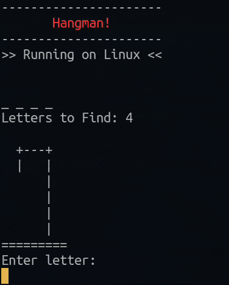

  
  <h1>Hangman</h1>
  
  <h3>The popular game, now inside your terminal!</h3>

  
  

## Technologies Used

&nbsp;&nbsp;&nbsp;&nbsp;&nbsp;&nbsp;

## Description

The popular game of hangman, created with Java, demonstrating the object-oriented programming paradigm. Pull requests are welcome!

## License

Copyright (c) 2022 Michael Kolesidis 
Licensed under the [GNU General Public License v3.0](https://www.gnu.org/licenses/gpl-3.0.html).

 
 

[//]: # (Free Software)

   
   

  

                                                       

  

